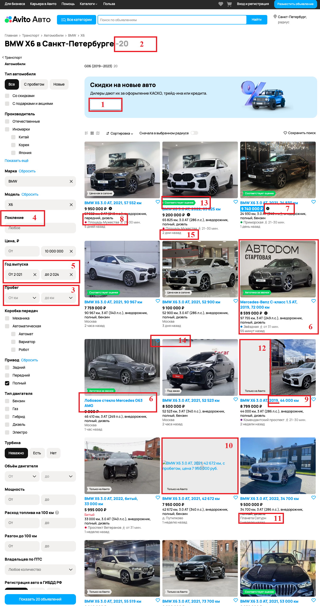

# Дефекты Avito Авто

** Порядковый номер дефекта соответсвует номеру на картинке.

| **№**                   | **Описание**                                                                                       | **Приоритет** | **Комментарий**                                                                                                                                                                                                                            |
|-------------------------|----------------------------------------------------------------------------------------------------|---------------|--------------------------------------------------------------------------------------------------------------------------------------------------------------------------------------------------------------------------------------------|
| **_Общие_**             |                                                                                                    |               |                                                                                                                                                                                                                                            |
| 1                       | Отсутствие   надписи на кнопке "Посмотреть" в баннере "Скидки на новое   авто".                    | High          | Отсутствие   надписи делает кнопку незаметной для пользователя. В результате баннер не   выполняет свой рекламной функции, что может повлечь нарушения договорных   обязательств с партнерами и как результат - убытки и имидживые потери. |
| 2                       | Знак   "-" в заголовке поиска после слов "в Санкт-Петербурге" и   перед количеством найденных авто | Low           | Не   влияет на функционал, но негативно сказывается на UX, т.к. складывается   впечатление, что отображается температура воздуха.                                                                                                          |
| **_Фильтры_**           |                                                                                                    |               |                                                                                                                                                                                                                                            |
| 3                       | В   фильтре "Пробег" значение устанавливается посредством выпадающего   меню                       | High          | Как   правило пробег авто измеряется в значениях кратных тысяче, выбор пробега из   меню делает данный фильтр крайне нефункциональным, что может вызвать резко   негативную реакцию пользователей.                                         |
| 4                       | Опечатка   в наименовании фильтра "Поколение" (пропущена вторая   "о").                            | Low           | Не   влияет на функционал, незначительно сказывается на UX.                                                                                                                                                                                |
| 5                       | Пробел   в отображении значения в фильтре "Год выпуска" между разрядом тысяч   и сотен.            | Low           | Не   влияет на функционал, незначительно сказывается на UX.                                                                                                                                                                                |
| **_Результаты поиска_** |                                                                                                    |               |                                                                                                                                                                                                                                            |
| 6                       | Отображаюся   товары не соответствующие установленым критериям поиска (лобовое стекло,   Mercedes) | High          | Некорретная   работа логики поиска и фильтрации. Дефект объективно мешает корректному   поиску.                                                                                                                                            |
| 7                       | Отображаются   товары со скидкой, хотя соответствующий фильтр не установен.                        | Medium        | Некорретная работа логики поиска и фильтрации. Результат поиска   не соответсвует ожидаемому, однако, авто относятся к одной марке\модели и не   вызывают резко негативного UX.                                                            |
| 8                       | Отображаются   авто с передним приводом, хотя установлена фильтрация по приводу   "Полный".        | Medium        | Некорретная работа логики поиска и фильтрации. Результат поиска   не соответсвует ожидаемому, однако, авто относятся к одной марке\модели и не   вызывают резко негативного UX.                                                            |
| 9                       | Отображаются   авто ранее 2021 года выпуска. Хотя установлена фильтрация от 2021                   | Medium        | Некорретная работа логики поиска и фильтрации. Результат поиска   не соответсвует ожидаемому, однако, авто относятся к одной марке\модели и не   вызывают резко негативного UX.                                                            |
| **_Карточка товара_**   |                                                                                                    |               |                                                                                                                                                                                                                                            |
| 10                      | Не   отображается фото товара                                                                      | High          | Отсутствие   фотографий товара объективно препятствует реализации основного функционала –   продажа товаров.                                                                                                                               |
| 11                      | Отображение   нереальной локации в карточке товара                                                 | High          | Не   понятно где находится товар и возникают сомнения в реальности объявления.   Объективно препятствует реализации основного функционала – продажа товаров.                                                                               |
| 12                      | Плашка   "Только на авито" занимает треть фото (вероятно слетели стили)                            | Medium        | Ухудшает восприятие   товара.                                                                                                                                                                                                              |
| 13                      | Плашка   съехала за пределы фото товара                                                            | Low           | Незначительно влияет на общий вид и UX, не влияет на логику.                                                                                                                                                                               |
| 14                      | "Сердечко"   съехало за пределы заголовка карточки товара                                          | Low           | Незначительно влияет на общий вид и UX, не влияет на логику.                                                                                                                                                                               |
| 15                      | Неверное   склонение слова "дни"                                                                   | Low           | Незначительно влияет на общий вид и UX, не влияет на логику.                                                                                                                                                                               |